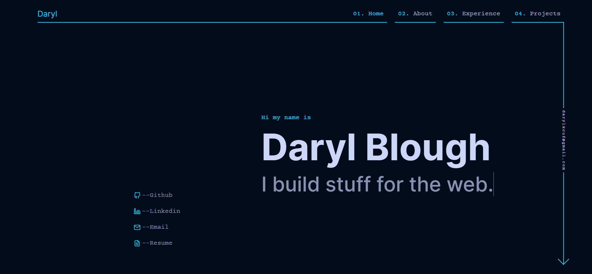
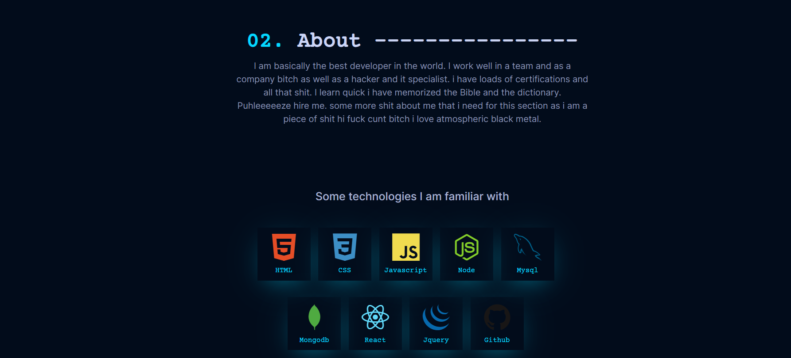
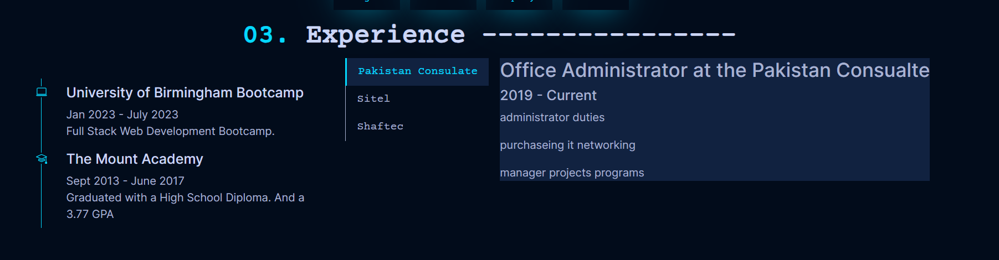
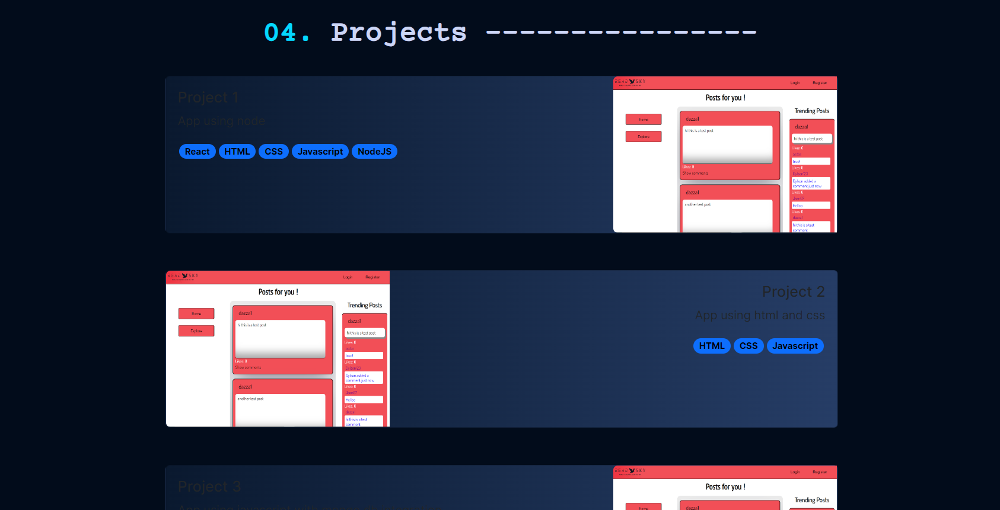

# DB Portfolio
This repository contains the source code for my personal portfolio website. It showcases my projects, skills, and experience.

# Description
DB Portfolio is a React application built using React principles for HTML CSS and Javascript. It serves as a showcase for my professional work and allows visitors to learn more about my skills and experience. The portfolio includes a variety of projects, ranging from web development to data analysis.

## TechStack

* React
* HTML
* CSS
* Javascript
* Bootstrap
*Github Pages

## Deployment
The portfolio website is deployed and accessible at https://darylbg.github.io/db-portfolio

the source code is available at https://github.com/darylbg/db-portfolio

the deployed application is will look similar to the following images: 

